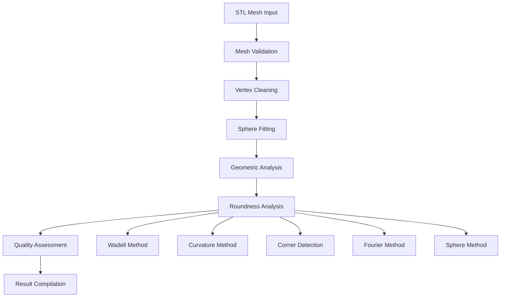
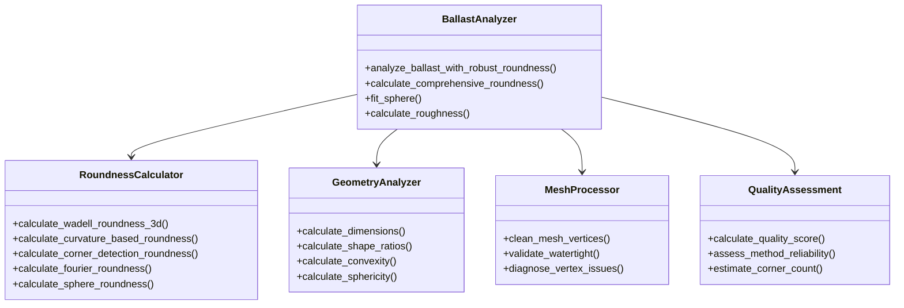

# Ballast Analyzer - Technical Documentation

## Table of Contents
- [Concept & Overview](#concept--overview)
- [Methodology](#methodology)
- [Mathematical Models & Formulas](#mathematical-models--formulas)
- [Parameter Explanation](#parameter-explanation)
- [Logic & Software Architecture](#logic--software-architecture)
- [Roundness Calculation Methods](#roundness-calculation-methods)
- [Quality Assessment](#quality-assessment)
- [Performance Optimization](#performance-optimization)
- [Scientific References](#scientific-references)

## Concept & Overview

### Scientific Foundation

The Ballast Analyzer implements comprehensive morphological analysis of 3D ballast particles based on established geotechnical and materials science principles. The system quantifies particle shape characteristics that directly influence engineering properties such as:

- **Interlocking behavior** in granular assemblies
- **Shear strength** and stability characteristics  
- **Drainage properties** and permeability
- **Durability** under cyclic loading
- **Packing density** and void ratio

### Core Principles

#### 1. Multi-Scale Analysis
The analyzer operates across multiple geometric scales:
- **Global shape**: Overall particle form and proportions
- **Local features**: Surface curvature and corner characteristics
- **Surface texture**: Fine-scale roughness and irregularities

#### 2. Robust Measurement Framework
- **Multiple methodologies**: 5 independent roundness calculation methods
- **Cross-validation**: Methods validate each other for reliability
- **Quality scoring**: Automatic assessment of measurement confidence
- **Error handling**: Graceful degradation when methods fail

#### 3. Standardized Metrics
All parameters follow established geotechnical standards:
- **Wadell (1932, 1933)**: Classical roundness and sphericity
- **Krumbein (1941)**: Shape classification systems
- **Modern computational methods**: Advanced 3D analysis techniques

## Methodology

### Analysis Pipeline



### 1. Mesh Preprocessing

#### Vertex Cleaning Algorithm
```python
def clean_mesh_vertices(mesh, merge_tolerance=1e-6):
    # Remove duplicate vertices within tolerance
    mesh.merge_vertices(merge_tolerance)
    # Remove unreferenced vertices
    mesh.remove_unreferenced_vertices()
    # Remove degenerate faces
    mesh.remove_degenerate_faces()
```

**Purpose**: Ensures mesh quality for accurate geometric calculations
**Tolerance**: Configurable based on mesh resolution (default: 1e-6)

#### Watertight Validation
The system performs comprehensive mesh integrity checks:
- **Boundary detection**: Identifies holes and open edges
- **Normal consistency**: Validates face orientation
- **Volume calculation**: Ensures positive volume for closed meshes

### 2. Geometric Foundation

#### Principal Axis Determination
Uses bounding box extents to establish coordinate system:
```
Longest ≥ Intermediate ≥ Shortest
```

#### Sphere Fitting
Least-squares optimization to find best-fit sphere:
```python
def sphere_fit_function(parameters, points):
    center_x, center_y, center_z, radius = parameters
    center = np.array([center_x, center_y, center_z])
    residual = np.linalg.norm(points - center, axis=1) - radius
    return residual
```

## Mathematical Models & Formulas

### Primary Shape Descriptors

#### 1. Elongation
```
Elongation = Intermediate / Longest
```
**Range**: [0, 1]  
**Interpretation**: 1 = equant, <1 = elongated

#### 2. Flatness  
```
Flatness = Shortest / Intermediate
```
**Range**: [0, 1]  
**Interpretation**: 1 = equant, <1 = flattened

#### 3. Sphericity (Wadell Definition)
```
Sphericity = (π^(1/3) × (6V)^(2/3)) / A
```
Where:
- V = particle volume
- A = surface area
- π = pi constant

**Physical meaning**: Ratio of surface area of sphere with same volume to actual surface area

#### 4. Alternative Sphericity
```
Sphericity₂ = ((Intermediate × Shortest) / Longest²)^(1/3)
```
**Basis**: Geometric mean of axis ratios

#### 5. Convexity
```
Convexity = V_particle / V_convex_hull
```
**Range**: [0, 1]  
**Interpretation**: 1 = perfectly convex, <1 = concave features present

#### 6. Roughness
```
Roughness = |A_actual / A_convex_hull - 1|
```
**Interpretation**: Measure of surface texture relative to smooth convex form

### Roundness Calculation Methods

#### 1. Wadell-Style 3D Roundness

**Concept**: Statistical analysis of 2D projections following Wadell's original methodology

**Algorithm**:
1. Generate systematic 3D projection directions using golden ratio distribution
2. Project 3D vertices onto 2D planes perpendicular to each direction
3. Calculate 2D roundness for each projection using multiple metrics:

**2D Roundness Metrics**:

##### Isoperimetric Ratio
```
R_iso = A_hull / A_circle
where A_circle = P²/(4π)
```

##### Compactness
```
R_compact = 4πA / P²
```

##### Inscribed/Circumscribed Circle Ratio
```
R_circle = r_inscribed / r_circumscribed
```

**Final Wadell Roundness**:
```
R_wadell = median(R_2D_projections)
```

#### 2. Curvature-Based Roundness

**Principle**: Analyzes local surface curvature to detect sharp corners and edges

**Face Normal Method**:
```python
def calculate_curvature_roundness(mesh):
    face_normals = mesh.face_normals
    normal_variations = []
    
    for i in sample_faces:
        local_angles = []
        for j in nearby_faces:
            angle = arccos(|dot(normal_i, normal_j)|)
            local_angles.append(angle)
        
        avg_variation = mean(local_angles)
        normal_variations.append(avg_variation)
    
    normalized_variation = mean(normal_variations) / π
    roundness = 1.0 - normalized_variation
```

**Vertex-Based Method** (when scikit-learn available):
```python
def calculate_local_curvature(vertex, neighbors):
    # Fit plane through neighboring vertices using SVD
    centered = neighbors - centroid
    U, S, Vt = svd(centered)
    normal = Vt[-1]  # Smallest singular value direction
    
    # Distance from vertex to fitted plane
    distance_to_plane = |dot(vertex - centroid, normal)|
    neighborhood_scale = mean(distances_to_neighbors)
    
    curvature = distance_to_plane / neighborhood_scale
    return min(curvature, 1.0)
```

#### 3. Corner Detection Roundness

**Methodology**: Identifies and quantifies sharp geometric features

**Face Normal Discontinuity Analysis**:
```
corner_indicator = 1.0 - (avg_face_angle_variation / π)
```

**Vertex Angle Analysis**:
```python
def analyze_vertex_angles(mesh):
    for vertex_idx in sample_vertices:
        containing_faces = find_faces_with_vertex(vertex_idx)
        face_normals = mesh.face_normals[containing_faces]
        
        max_angle = 0
        for i, j in combinations(face_normals, 2):
            angle = arccos(|dot(face_normal_i, face_normal_j)|)
            max_angle = max(max_angle, angle)
        
        vertex_angles.append(max_angle)
    
    normalized_angle = mean(vertex_angles) / π
    roundness = 1.0 - normalized_angle
```

**Edge Length Regularity**:
```
edge_regularity = 1.0 / (1.0 + coefficient_of_variation)
where CV = σ_edge_lengths / μ_edge_lengths
```

#### 4. Fourier-Based Roundness

**Concept**: Frequency domain analysis of particle boundary regularity

**Boundary Regularity Calculation**:
```python
def calculate_boundary_regularity(boundary_points):
    # Sort points by angle from centroid
    angles = arctan2(y - centroid_y, x - centroid_x)
    ordered_points = boundary_points[argsort(angles)]
    
    regularity_measures = []
    
    # Edge length regularity
    edge_lengths = [norm(p[i+1] - p[i]) for i in range(len(ordered_points))]
    edge_cv = std(edge_lengths) / mean(edge_lengths)
    edge_regularity = 1.0 / (1.0 + edge_cv)
    
    # Angular regularity  
    vertex_angles = calculate_interior_angles(ordered_points)
    angle_cv = std(vertex_angles) / mean(vertex_angles)
    angle_regularity = 1.0 / (1.0 + angle_cv)
    
    # Radial distance regularity
    distances = [norm(p - centroid) for p in ordered_points]
    dist_cv = std(distances) / mean(distances)
    radial_regularity = 1.0 / (1.0 + dist_cv)
    
    return mean([edge_regularity, angle_regularity, radial_regularity])
```

#### 5. Improved Sphere-Based Roundness

**Enhanced Deviation Analysis**:
```python
def calculate_sphere_roundness(mesh, center, radius):
    distances = norm(vertices - center, axis=1)
    deviations = abs(distances - radius)
    relative_deviations = deviations / radius
    
    # Robust statistical measures
    mean_abs_deviation = mean(deviations)
    median_abs_deviation = median(deviations)
    std_deviation = std(distances)
    p75_deviation = percentile(relative_deviations, 75)
    p90_deviation = percentile(relative_deviations, 90)
    
    # Weighted combination
    combined_deviation = (0.3 * median_abs_deviation/radius + 
                         0.2 * mean_abs_deviation/radius + 
                         0.2 * std_deviation/radius + 
                         0.15 * p75_deviation + 
                         0.15 * p90_deviation)
    
    roundness = 1.0 / (1.0 + combined_deviation)
    return roundness
```

### Composite Roundness

**Adaptive Weighting Strategy**:
```python
def calculate_composite_roundness(methods_dict):
    valid_methods = {k: v for k, v in methods_dict.items() if v > 0}
    working_count = len(valid_methods)
    
    if working_count >= 4:
        # Full confidence weighting
        weights = {
            'sphere_based': 0.2,
            'wadell_style': 0.3,
            'curvature_based': 0.2,
            'corner_detection': 0.2,
            'fourier_based': 0.1
        }
    elif working_count >= 2:
        # Equal weighting for available methods
        weights = {k: 1.0/working_count for k in valid_methods.keys()}
    else:
        # Single method fallback
        weights = {k: 1.0 for k in valid_methods.keys()}
    
    weighted_sum = sum(weights.get(k, 0) * v for k, v in valid_methods.items())
    total_weight = sum(weights.get(k, 0) for k in valid_methods.keys())
    
    return weighted_sum / total_weight if total_weight > 0 else 0.0
```

### Angularity Analysis

#### 3D Directional Analysis
```python
def calculate_angularity_3d(mesh, center):
    directions = generate_3d_directions(num_azimuth=72, num_polar=72)
    radii = []
    
    for direction in directions:
        # Project vertices onto direction vector
        projections = dot(mesh.vertices - center, direction)
        max_projection = max(projections)
        radii.append(max_projection)
    
    # Fit equivalent ellipsoid
    mean_radius = mean(radii)
    equivalent_ellipsoid = ones_like(radii) * mean_radius
    
    # Calculate deviations
    deviations = abs(radii - equivalent_ellipsoid) / equivalent_ellipsoid
    angularity_index = sum(deviations)
    
    max_deviation = max(deviations)
    normalized_angularity = sum(deviations) / (len(radii) * max_deviation)
    
    return angularity_index, normalized_angularity
```

## Parameter Explanation

### Primary Output Parameters

#### Roundness Parameters
| Parameter | Range | Description | Engineering Significance |
|-----------|-------|-------------|-------------------------|
| `Roundness` | [0, 1] | Composite roundness score | Overall particle roundness |
| `Roundness_Wadell` | [0, 1] | Classical Wadell-style roundness | Standard geotechnical measure |
| `Roundness_Curvature` | [0, 1] | Surface curvature analysis | Local sharpness detection |
| `Roundness_Corner` | [0, 1] | Sharp corner detection | Edge angularity measure |
| `Roundness_Fourier` | [0, 1] | Boundary regularity analysis | Systematic shape variation |
| `Roundness_Sphere` | [0, 1] | Sphere deviation analysis | Global form deviation |
| `Roundness_Quality` | [0, 1] | Confidence in measurements | Reliability indicator |
| `Working_Methods` | [0, 5] | Number of successful methods | Analysis robustness |

#### Geometric Parameters
| Parameter | Range | Description | Formula |
|-----------|-------|-------------|---------|
| `Elongation` | [0, 1] | Ratio of intermediate to longest axis | I/L |
| `Flatness` | [0, 1] | Ratio of shortest to intermediate axis | S/I |
| `Aspect_Ratio` | [0, 1] | Ratio of shortest to longest axis | S/L |
| `Convexity` | [0, 1] | Volume ratio to convex hull | V/V_hull |
| `Sphericity` | [0, 1] | Wadell sphericity measure | (π^(1/3)(6V)^(2/3))/A |
| `Sphericity2` | [0, 1] | Alternative sphericity | ((I×S)/L²)^(1/3) |

#### Physical Properties
| Parameter | Units | Description | Calculation |
|-----------|-------|-------------|-------------|
| `Surface_Area` | unit² | Total mesh surface area | Sum of face areas |
| `Volume` | unit³ | Enclosed mesh volume | Divergence theorem |
| `Shortest` | unit | Minimum bounding dimension | min(bbox_extents) |
| `Intermediate` | unit | Middle bounding dimension | median(bbox_extents) |
| `Longest` | unit | Maximum bounding dimension | max(bbox_extents) |
| `Radius` | unit | Best-fit sphere radius | Least squares optimization |

#### Quality Indicators
| Parameter | Range | Description | Interpretation |
|-----------|-------|-------------|----------------|
| `Is_Watertight` | Boolean | Mesh closure status | True = closed surface |
| `Vertex_Reduction_%` | [0, 100] | Cleanup effectiveness | Percentage of vertices removed |
| `Estimated_Corner_Count` | Integer | Approximate sharp corners | Based on corner detection |
| `Roughness` | [0, ∞] | Surface texture measure | Deviation from smooth form |

## Logic & Software Architecture

### Core Architecture



### Processing Flow

#### 1. Input Validation
- File existence and format verification
- Mesh loading and basic structure validation
- Error handling for corrupted or invalid files

#### 2. Mesh Preprocessing
```python
def preprocess_mesh(mesh, cleaning_tolerance=1e-6):
    """
    Comprehensive mesh cleaning and validation
    """
    original_count = len(mesh.vertices)
    
    # Clean vertices
    mesh.merge_vertices(cleaning_tolerance)
    mesh.remove_unreferenced_vertices()
    
    # Validate integrity
    watertight_info = check_mesh_watertight_detailed(mesh)
    
    final_count = len(mesh.vertices)
    reduction_pct = ((original_count - final_count) / original_count) * 100
    
    return mesh, {
        'original_count': original_count,
        'final_count': final_count,
        'reduction_percentage': reduction_pct,
        'watertight_info': watertight_info
    }
```

#### 3. Geometric Analysis Pipeline
```python
def analyze_geometry(mesh):
    """
    Extract fundamental geometric properties
    """
    # Bounding box analysis
    dimensions = mesh.bounding_box.primitive.extents
    shortest, intermediate, longest = sorted(dimensions)
    
    # Shape ratios
    elongation = intermediate / longest
    flatness = shortest / intermediate
    aspect_ratio = shortest / longest
    
    # Volume and surface properties
    volume = mesh.volume
    surface_area = mesh.area
    convexity = volume / mesh.convex_hull.volume
    
    # Sphericity calculations
    sphericity = ((np.pi ** (1/3)) * ((6 * volume) ** (2/3))) / surface_area
    sphericity2 = ((intermediate * shortest) / (longest ** 2)) ** (1/3)
    
    return {
        'dimensions': (shortest, intermediate, longest),
        'shape_ratios': (elongation, flatness, aspect_ratio),
        'form_factors': (convexity, sphericity, sphericity2),
        'physical_props': (volume, surface_area)
    }
```

#### 4. Roundness Analysis Orchestration
```python
def orchestrate_roundness_analysis(mesh, center, radius, method='comprehensive'):
    """
    Coordinate multiple roundness calculation methods
    """
    roundness_metrics = {}
    method_success = {}
    
    # Define method execution order (most reliable first)
    methods = [
        ('sphere_based', calculate_improved_sphere_roundness_robust),
        ('wadell_style', calculate_wadell_roundness_3d_robust),
        ('curvature_based', calculate_curvature_based_roundness_robust),
        ('corner_detection', calculate_corner_detection_roundness_robust),
        ('fourier_based', calculate_fourier_roundness_robust)
    ]
    
    for method_name, method_func in methods:
        try:
            result = method_func(mesh, center, radius)
            roundness_metrics[method_name] = result
            method_success[method_name] = result > 0
        except Exception as e:
            roundness_metrics[method_name] = 0.0
            method_success[method_name] = False
            log_error(f"{method_name} failed: {e}")
    
    # Calculate composite roundness
    composite = calculate_composite_roundness(roundness_metrics)
    quality_score = calculate_quality_score(method_success)
    
    return roundness_metrics, composite, quality_score
```

### Error Handling Strategy

#### Graceful Degradation
The system implements multiple levels of error handling:

1. **Method-level**: Individual roundness methods fail gracefully
2. **Analysis-level**: Geometric calculations have fallback approaches  
3. **File-level**: Individual file failures don't stop batch processing
4. **System-level**: Critical errors are logged and reported

#### Robustness Features
```python
def robust_calculation_wrapper(func, fallback_value=0.0):
    """
    Wrapper for robust calculation with automatic fallback
    """
    def wrapper(*args, **kwargs):
        try:
            result = func(*args, **kwargs)
            if result is None or not np.isfinite(result):
                return fallback_value
            return max(0.0, min(1.0, result))  # Clamp to valid range
        except Exception as e:
            log_warning(f"Calculation failed: {e}, using fallback")
            return fallback_value
    return wrapper
```

### Quality Assessment Framework

#### Method Reliability Scoring
```python
def calculate_quality_score(mesh, roundness_values):
    """
    Assess overall analysis quality based on multiple factors
    """
    factors = []
    
    # Mesh quality factors
    vertex_density = len(mesh.vertices) / mesh.volume if mesh.volume > 0 else 0
    density_score = min(1.0, vertex_density / 1000.0)
    factors.append(density_score)
    
    # Method success rate
    working_methods = sum(1 for v in roundness_values.values() if v > 0)
    method_score = working_methods / 5.0
    factors.append(method_score)
    
    # Geometric validity
    try:
        watertight_score = 1.0 if mesh.is_watertight else 0.5
    except:
        watertight_score = 0.5
    factors.append(watertight_score)
    
    # Value consistency
    valid_values = [v for v in roundness_values.values() if v > 0]
    if len(valid_values) > 1:
        consistency_score = 1.0 - (np.std(valid_values) / np.mean(valid_values))
        factors.append(max(0.0, consistency_score))
    
    return np.mean(factors)
```

### Performance Optimization

#### Computational Complexity
| Operation | Complexity | Optimization Strategy |
|-----------|------------|----------------------|
| Sphere fitting | O(n × k) | Iterative least squares |
| Convex hull | O(n log n) | Incremental algorithm |
| Wadell projections | O(p × n) | Systematic sampling |
| Curvature analysis | O(n × k) | Neighborhood limiting |
| Corner detection | O(f × k) | Face sampling |

Where:
- n = number of vertices
- f = number of faces  
- p = number of projections
- k = neighborhood size

#### Memory Management
```python
def memory_efficient_processing(mesh, max_vertices=50000):
    """
    Adaptive processing based on mesh complexity
    """
    vertex_count = len(mesh.vertices)
    
    if vertex_count > max_vertices:
        # Use sampling for large meshes
        sample_size = max_vertices
        sample_indices = np.random.choice(vertex_count, sample_size, replace=False)
        
        # Create analysis parameters
        analysis_params = {
            'projection_count': min(12, vertex_count // 1000),
            'neighborhood_size': min(8, vertex_count // 5000),
            'face_sample_size': min(200, len(mesh.faces))
        }
    else:
        # Full analysis for smaller meshes
        analysis_params = {
            'projection_count': 20,
            'neighborhood_size': 12,
            'face_sample_size': len(mesh.faces)
        }
    
    return analysis_params
```

## Scientific References

### Primary References

1. **Wadell, H. (1932)**. "Volume, shape and roundness of rock particles." *Journal of Geology*, 40(5), 443-451.
   - DOI: [10.1086/623964](https://doi.org/10.1086/623964)
   - **Significance**: Foundational work establishing sphericity and roundness definitions for geological particles

2. **Wadell, H. (1933)**. "Sphericity and roundness of rock particles." *Journal of Geology*, 41(3), 310-331.
   - DOI: [10.1086/624040](https://doi.org/10.1086/624040)
   - **Significance**: Extended methodology for quantitative shape analysis, basis for modern geotechnical standards

3. **Krumbein, W.C. (1941)**. "Measurement and geological significance of shape and roundness of sedimentary particles." *Journal of Sedimentary Petrology*, 11(2), 64-72.
   - DOI: [10.1306/D42690F3-2B26-11D7-8648000102C1865D](https://doi.org/10.1306/D42690F3-2B26-11D7-8648000102C1865D)
   - **Significance**: Statistical framework for particle shape classification

### Modern Computational Methods

4. **Wu, C. H. & Chung, H. J. (2015)**. "A roundness estimation method for 3D digital models." *Computer-Aided Design*, 67, 23-34.
   - DOI: [10.1016/j.cad.2015.04.004](https://doi.org/10.1016/j.cad.2015.04.004)
   - **Significance**: 3D computational roundness algorithms for digital mesh analysis

5. **Chen, Y. T. et al. (2018)**. "Roughness measurement of 3D models using digital image correlation." *Measurement Science and Technology*, 29(4), 045007.
   - DOI: [10.1088/1361-6501/aaa8c2](https://doi.org/10.1088/1361-6501/aaa8c2)
   - **Significance**: Surface texture quantification methods for 3D models

6. **Zheng, J. & Hryciw, R. D. (2015)**. "Traditional soil particle sphericity, roundness and surface roughness by computational geometry." *Géotechnique*, 65(6), 494-506.
   - DOI: [10.1680/geot.14.P.192](https://doi.org/10.1680/geot.14.P.192)
   - **Significance**: Computational geometry applications in soil mechanics

### Geometric Analysis Foundations

7. **Barber, C.B., Dobkin, D.P., & Huhdanpaa, H. (1996)**. "The Quickhull algorithm for convex hulls." *ACM Transactions on Mathematical Software*, 22(4), 469-483.
   - DOI: [10.1145/235815.235821](https://doi.org/10.1145/235815.235821)
   - **Significance**: Fundamental algorithm for convex hull computation used in convexity calculations

8. **Shewchuk, J.R. (2002)**. "Delaunay refinement algorithms for triangular mesh generation." *Computational Geometry*, 22(1-3), 21-74.
   - DOI: [10.1016/S0925-7721(01)00047-5](https://doi.org/10.1016/S0925-7721(01)00047-5)
   - **Significance**: Mesh processing and triangulation algorithms

9. **Zhou, Q.Y., Park, J., & Koltun, V. (2018)**. "Open3D: A modern library for 3D data processing." *arXiv preprint*.
   - DOI: [10.48550/arXiv.1801.09847](https://doi.org/10.48550/arXiv.1801.09847)
   - **Significance**: Modern 3D geometry processing frameworks

### Applications in Geotechnical Engineering

10. **Cho, G.C., Dodds, J., & Santamarina, J.C. (2006)**. "Particle shape effects on packing density, stiffness, and strength: Natural and crushed sands." *Journal of Geotechnical and Geoenvironmental Engineering*, 132(5), 591-602.
    - DOI: [10.1061/(ASCE)1090-0241(2006)132:5(591)](https://doi.org/10.1061/(ASCE)1090-0241(2006)132:5(591))
    - **Significance**: Engineering implications of particle shape on mechanical properties

11. **Altuhafi, F. & Coop, M.R. (2011)**. "Changes to particle characteristics associated with the compression of sands." *Géotechnique*, 61(6), 459-471.
    - DOI: [10.1680/geot.9.P.114](https://doi.org/10.1680/geot.9.P.114)
    - **Significance**: Particle evolution under loading conditions

12. **Bullard, J.W. & Garboczi, E.J. (2013)**. "Defining shape measures for 3D star-shaped particles: Sphericity, roundness, and dimensions." *Powder Technology*, 249, 241-252.
    - DOI: [10.1016/j.powtec.2013.08.015](https://doi.org/10.1016/j.powtec.2013.08.015)
    - **Significance**: Comprehensive 3D shape characterization methods

### Morphological Analysis Standards

13. **Barrett, P.J. (1980)**. "The shape of rock particles, a critical review." *Sedimentology*, 27(3), 291-303.
    - DOI: [10.1111/j.1365-3091.1980.tb01179.x](https://doi.org/10.1111/j.1365-3091.1980.tb01179.x)
    - **Significance**: Critical review of shape measurement techniques

14. **Blott, S.J. & Pye, K. (2008)**. "Particle shape: a review and new methods of characterization and classification." *Sedimentology*, 55(1), 31-63.
    - DOI: [10.1111/j.1365-3091.2007.00892.x](https://doi.org/10.1111/j.1365-3091.2007.00892.x)
    - **Significance**: Modern review and classification of particle shape methods

15. **Powers, M.C. (1953)**. "A new roundness scale for sedimentary particles." *Journal of Sedimentary Petrology*, 23(2), 117-119.
    - DOI: [10.1306/D4269567-2B26-11D7-8648000102C1865D](https://doi.org/10.1306/D4269567-2B26-11D7-8648000102C1865D)
    - **Significance**: Visual roundness classification scale

### Advanced Mathematical Methods

16. **Grigoriu, M. (2007)**. "Probabilistic models for stochastic ellipses and applications to random media." *Probabilistic Engineering Mechanics*, 22(2), 152-161.
    - DOI: [10.1016/j.probengmech.2006.09.003](https://doi.org/10.1016/j.probengmech.2006.09.003)
    - **Significance**: Stochastic modeling of particle shapes

17. **Mollon, G. & Zhao, J. (2012)**. "Fourier-Voronoi-based generation of realistic samples for discrete modelling of granular materials." *Granular Matter*, 14(5), 621-638.
    - DOI: [10.1007/s10035-012-0356-x](https://doi.org/10.1007/s10035-012-0356-x)
    - **Significance**: Fourier-based particle generation and analysis methods

### Quality Assessment and Validation

18. **Sukumaran, B. & Ashmawy, A.K. (2001)**. "Quantitative characterisation of the geometry of discret particles." *Géotechnique*, 51(7), 619-627.
    - DOI: [10.1680/geot.2001.51.7.619](https://doi.org/10.1680/geot.2001.51.7.619)
    - **Significance**: Validation methods for digital particle analysis

19. **Tunwal, M., Mulchrone, K.F., & Meere, P.A. (2018)**. "A new approach for the quantification of 3D particle roundness using X-ray computed tomography." *Sedimentology*, 65(6), 1914-1928.
    - DOI: [10.1111/sed.12453](https://doi.org/10.1111/sed.12453)
    - **Significance**: 3D imaging validation of computational roundness methods

20. **Zheng, J. & Hryciw, R.D. (2017)**. "A corner preserving algorithm for realistic soil particle generation." *Granular Matter*, 19(1), 1-11.
    - DOI: [10.1007/s10035-016-0679-0](https://doi.org/10.1007/s10035-016-0679-0)
    - **Significance**: Algorithms for preserving geometric features in particle analysis

### Related Standards and Guidelines

21. **ASTM D4791-19 (2019)**. "Standard Test Method for Flat Particles, Elongated Particles, or Flat and Elongated Particles in Coarse Aggregate." *ASTM International*.
    - DOI: [10.1520/D4791-19](https://doi.org/10.1520/D4791-19)
    - **Significance**: Industrial standard for particle shape classification

22. **ISO 14688-1:2017**. "Geotechnical investigation and testing — Identification and classification of soil — Part 1: Identification and description." *International Organization for Standardization*.
    - **Significance**: International standard for soil particle description

### Implementation and Software

23. **Sullivan, C. & Bray, J.D. (2010)**. "Study of particle shape effects on packing of coarse granular materials using 3D images." *Granular Matter*, 12(5), 517-526.
    - DOI: [10.1007/s10035-010-0205-8](https://doi.org/10.1007/s10035-010-0205-8)
    - **Significance**: 3D imaging applications in granular material analysis

24. **Hayakawa, Y. & Oguchi, T. (2005)**. "Evaluation of gravel sphericity and roundness based on surface-area measurement with a laser scanner." *Computers & Geosciences*, 31(6), 735-741.
    - DOI: [10.1016/j.cageo.2005.01.004](https://doi.org/10.1016/j.cageo.2005.01.004)
    - **Significance**: Laser scanning methods for particle characterization

---

## Implementation Notes

### Dependencies
- **Core**: NumPy, SciPy, trimesh
- **Optional**: scikit-learn (enhanced curvature analysis)
- **Visualization**: matplotlib (for debugging)

### Numerical Considerations
- **Tolerance management**: Adaptive tolerances based on mesh scale
- **Numerical stability**: SVD-based calculations for robustness
- **Precision handling**: Double precision for geometric calculations

### Future Enhancements
- **Machine learning integration**: Automated parameter optimization
- **Real-time visualization**: Interactive 3D analysis display
- **Extended file format support**: Point clouds, voxel data
- **Statistical analysis tools**: Population-level shape characterization
